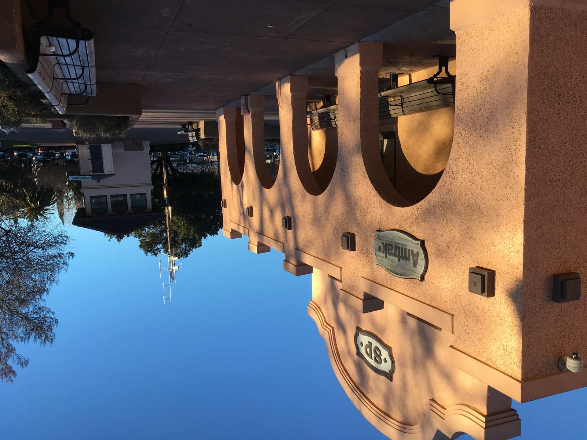

```{=html}
<!-- Main menu grid -->
<div class="grid-menu">
<a href="directions.html">

<span class="label">Directions</span>
</a>
<a href="accommodations.html">

<span class="label">Accommodations</span>
</a>
<a href="local.html">

<span class="label">Local<br>Information</span>
</a>
<a href="schedule.html">

<span class="label">Conference<br>Schedule</span>
</a>
</div>
```
<!-- Credit / attribution text -->
<div class="grid-credit">
With thanks to the Department of History at Stanford University,
the Margaret Byrne Chair of American History at the University of
California, Berkeley, and the Department of History, the College
of Letters and Science, and the Office of the Provost at the
University of California, Davis.
</div>


