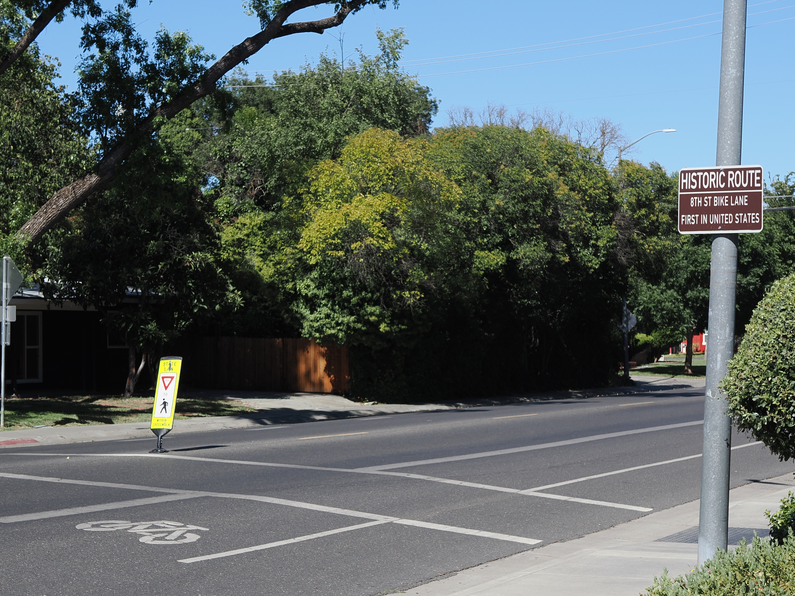

<div class="page-nav"><p><a href="index.html">← Home</a></p></div>


Kayak recommends Davis on its 2026 list of college towns worth a weekend visit, citing its ["farmers' market and sustainability-first mindset. It's an easygoing, under-the-radar NorCal gem."](https://www.kayak.com/news/underrated-college-towns/#davis) You may therefore want to spend some of your free time seeing town. This page has advice on how to get around and what to expect from the weather.

## Weather

In April temperatures may range from the 50s into the 70s or 80s (Fahrenheit) over the course of a day. Humidity is likely to be low. It's been known to rain, though chances are slim. You'll be well served by bringing a light jacket you won't mind removing and carrying during the day.

### Forecast and current conditions

````{=html}
<div style="position:relative; width:100%; max-width:650px; margin:0 auto; aspect-ratio:650/450;">
<iframe style="position:absolute; inset:0; width:100%; height:100%; border:0;" title="Windy weather map for Davis, CA"
  src="https://embed.windy.com/embed.html?type=map&location=coordinates&metricRain=default&metricTemp=default&metricWind=default&zoom=9&overlay=wind&product=&level=surface&lat=38.5435526&lon=-121.739005&detailLat=38.5435526&detailLon=-121.739005&detail=true"></iframe>
</div>
````

## Bike

Home to the United States' first-ever bike lane, Davis does its utmost to welcome bicyclists. If you wish to rent a bike while here, you may visit [the UC Davis Bike Barn,](https://bikebarn.ucdavis.edu/rentals) a short walk from the hotel and conference center. The city is relatively flat and easy to bike around.

::: {layout-ncol=2}

{.lightbox}

{.lightbox}

:::

## Bus

The local bus service, [Unitrans,](https://unitrans.ucdavis.edu) some of whose buses are repurposed London Routemasters, will take you around town. It may be particularly useful for traveling to Oak Avenue destinations.

{.lightbox}

<hr>

<div class="page-nav"><p><a href="index.html">← Home</a></p></div>


